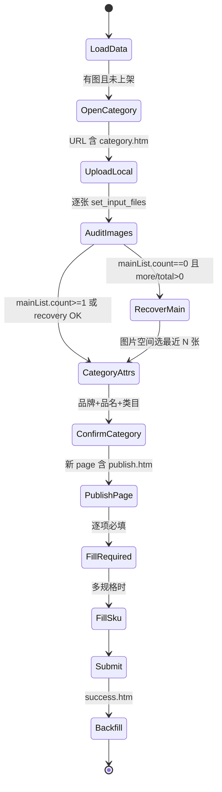

# 淘宝商品上传 — Playwright 爬虫方案开发文档

> **目标**：用 **Python + Playwright（Chromium）+ playwright-stealth** 独立完成「以图发品 → 类目确认 → 发布填表 → 提交 → Excel 回填」全链路，**不依赖** chrome-robot MCP、Chrome 扩展、pyautogui 坐标点击。  
> **业务来源**：`.cursor/skills/taobao-publish/SKILL.md`、`docs/淘宝/淘宝商品上传问题.md` 及 2026-06 实战结论（主图/更多图片分流、图片空间弹框补主图）。  
> **数据目录**：`C:\Users\yao\Desktop\work\电商数据\淘宝`（总表 + 单品目录 + `images/`）

---

## 1. 为什么要换 Playwright

| 维度 | 现有方案（MCP + pyautogui） | Playwright 方案 |
|------|---------------------------|-----------------|
| 文件上传 | OS 文件对话框，坐标/DPI/窗口置前易失败 | 优先 `input[type=file].set_input_files()`，**不走系统对话框** |
| DOM 操作 | 扩展 WebSocket，易 `COMMAND_TIMEOUT` | 原生 `page` / `locator`，可 `wait_for` |
| 多 Tab | 需手动 `page_get_tabs` | `context.wait_for_event('page')` |
| iframe 弹框 | 扩展仅 top frame | `frame_locator` / 遍历 `page.frames` |
| 部署 | Cursor + 扩展 + MCP 三件套 | 单 Python 进程 + Chromium |
| 登录态 | 用户日常 Chrome | **持久化 Profile** 或 `storage_state.json` |

**边界**：Playwright 仍无法绕过淘宝风控/滑块/短信；遇到验证码需 **暂停 + 人工介入** 后继续（文档第 8 节）。

---

## 2. 技术栈与依赖

```text
Python >= 3.10
playwright >= 1.40
playwright-stealth          # 或 playwright_stealth 包，按你选用的 API 为准
openpyxl                    # 复用现有 Excel 读写
pydantic >= 2               # 配置与步骤结果模型（推荐）
structlog / logging         # 结构化日志 → logs/YYYY-MM-DD/
```

```bash
pip install playwright playwright-stealth openpyxl pydantic
playwright install chromium
```

**stealth 接入示例**（二选一，以你安装的包文档为准）：

```python
# 方式 A：playwright_stealth.stealth_sync(page)
from playwright_stealth import stealth_sync

# 方式 B：stealth_async(page)  async 版
```

启动建议：

- `channel="chromium"` 或 bundled Chromium，**不要用**已装 chrome-robot 扩展的用户 Profile（避免 9222 冲突）。
- 独立目录：`user_data_dir=Path("data/taobao_browser_profile")`，首次手动登录千牛/卖家中心后长期复用。

---

## 3. 推荐工程结构

放在本仓库 **`mcp-server/script/taobao_playwright/`**（与现有 `read_product_data.py` 同层，便于复用数据脚本；**不**放进 `chrome-extension/`）：

```text
mcp-server/script/taobao_playwright/
├── README.md
├── pyproject.toml / requirements.txt
├── config.py                 # 路径、超时、URL、是否 headless
├── browser.py                # 启动 Chromium + stealth + 持久化上下文
├── data/
│   ├── loader.py             # 封装 read_product_data / 总表优先读 淘宝商品汇总.xlsx
│   └── backfill.py           # 封装 backfill_result 逻辑
├── pages/
│   ├── category_page.py      # sell/ai/category.htm 以图发品
│   ├── media_popup.py        # images-v2-media-popup 图片空间
│   └── publish_page.py       # sell/v2/publish.htm 发布表单
├── flows/
│   └── publish_one.py        # 单商品状态机（主入口）
├── audit/
│   └── image_lists.py        # 商品主图 / 更多图片 列表审计
├── cli.py                    # python -m taobao_playwright.cli --keyword 宋朝
└── tests/
    └── test_image_audit.py   # 纯 DOM 解析单测（HTML fixture）
```

**日志与快照**：一律写入 `logs/YYYY-MM-DD/taobao-pw/{product_slug}/`（截图、audit.json、step.jsonl）。

---

## 4. 端到端状态机（单商品）

与 Skill「金标准流水线」一一对应，便于从 MCP 方案迁移。



| Step | 名称 | 通过闸门 | 禁止 |
|------|------|----------|------|
| 0 | 读数据 | `image_count>=1`，`上架链接` 为空 | 无图开跑 |
| 1 | 打开以图发品 | `sell/ai/category.htm` | 在他人 `publish.htm` 草稿继续 |
| 2 | 本地上传 | 每张 `set_input_files` 后等待渲染 | 一次多 path 批量 |
| 2b | 图片审计 | 见 **第 5 节** | 未审计点「确认，下一步」 |
| 2c | 主图补救 | `mainList.count>=1` | 主图空强行下一步 |
| 3 | 类目属性 | 品牌+品名/型号，`确认，下一步` enabled | 只改 input.value |
| 4 | 发布页 | 新 `Page`，`publish.htm` | 仍在 category 页操作 |
| 5–7 | 填表+规格+价 | 左侧错误数下降 | 只填一口价不建 SKU（规格≥2 时） |
| 8 | 提交 | `success.htm` + `primaryId` | 未 success 做下一品 |
| 9 | 回填 | 总表 + 单品 xlsx | — |

---

## 5. 图片上传（核心，替代 pyautogui）

### 5.1 业务规则（必须实现）

1. **非 1:1 图片**不会进「商品主图」，会进 **「更多图片」** — 上传成功 ≠ 主图有图。  
2. **审计必须看两个列表**，不能全页数 88×88 槽。  
3. 若 **商品主图列表为空**，但「更多图片」或「已上传 N 张」表明已传：  
   - 点击 **商品主图第一个「上传图片」空槽**  
   - 弹出 **`images-v2-media-popup`**（图片空间）  
   - 勾选 **最近上传** 的 N 张 → 确定  
   - 平台会将选中图 **处理为 1:1 商品主图**  
4. **两条上传路径不可混用**：

| 路径 | 触发 | Playwright 做法 |
|------|------|-----------------|
| 本地上传 | 顶部「从本地上传」 | 找关联 `input[type=file]` → `set_input_files` |
| 图片空间补主图 | 主图区第一个空槽 | 操作 `images-v2-media-popup` 内 iframe/列表 |

### 5.2 DOM 锚点（类目页）

根容器：

```css
#ai-category-page-main-do-not-add-padding
```

列表容器（类名哈希可能变，用 `[class*="valueRenderWrap"]` + 子节点序号）：

```text
valueRenderWrap
  ├─ children[1]  → 商品主图列表
  └─ children[2]  → 更多图片列表（常含 imageWrap）
```

「从本地上传」按钮（优先文本，其次 class）：

```python
page.get_by_role("button", name=re.compile("从本地上传"))
# 或 page.locator('button:has(span:text("从本地上传"))')
```

### 5.3 本地上传实现要点

```python
async def upload_one_local(page, file_path: Path) -> None:
    btn = page.get_by_role("button", name="从本地上传")
    await btn.scroll_into_view_if_needed()

    # 策略 1：按钮同层或父层 hidden file input（最常见）
    file_input = page.locator('input[type="file"]').first
    if await file_input.count() == 0:
        async with page.expect_file_chooser() as fc_info:
            await btn.click()
        file_chooser = await fc_info.value
        await file_chooser.set_files(str(file_path))
    else:
        await file_input.set_input_files(str(file_path))

    await page.wait_for_timeout(5000)  # AI 处理；可改为 wait_for 缩略图/文案
```

**逐张上传**：每张之间 `await asyncio.sleep(6)`，且 **每张前重新 locate 按钮**（DOM 会变）。

### 5.4 审计 API（`audit/image_lists.py`）

```python
@dataclass
class ImageListAudit:
    main_count: int
    more_count: int
    total_in_lists: int
    uploaded_hint: int | None      # 正文「已上传 N 张」
    needs_main_recovery: bool      # main==0 and (more>0 or hint>0)
    confirm_next_disabled: bool | None
    has_media_popup: bool

async def audit_category_images(page) -> ImageListAudit:
    data = await page.evaluate("""() => {
      const root = document.querySelector('#ai-category-page-main-do-not-add-padding');
      const wrap = root?.querySelector('[class*="valueRenderWrap"]');
      const sections = wrap ? [...wrap.children].filter(el => el.tagName === 'DIV') : [];
      const scan = (container) => {
        if (!container) return { count: 0 };
        const imgs = [...container.querySelectorAll('img')].filter(
          img => /alicdn|imgextra|tbcdn/.test(img.src) && img.getBoundingClientRect().width > 8
        );
        return { count: imgs.length };
      };
      const hint = (document.body.innerText.match(/已上传\\s*(\\d+)\\s*张/) || [])[1];
      const confirm = [...document.querySelectorAll('button')].find(
        b => b.innerText.includes('确认') && b.innerText.includes('下一步')
      );
      return {
        main: scan(sections[1]),
        more: scan(sections[2]),
        uploadedHint: hint ? parseInt(hint, 10) : null,
        confirmDisabled: confirm ? confirm.disabled : null,
        hasMediaPopup: !!document.querySelector('[class*="images-v2-media-popup"]'),
      };
    }""")
    main, more = data["main"]["count"], data["more"]["count"]
    hint = data.get("uploadedHint")
    return ImageListAudit(
        main_count=main,
        more_count=more,
        total_in_lists=main + more,
        uploaded_hint=hint,
        needs_main_recovery=(main == 0 and (more > 0 or (hint or 0) > 0)),
        confirm_next_disabled=data.get("confirmDisabled"),
        has_media_popup=data.get("hasMediaPopup", False),
    )
```

**闸门**：

- `needs_main_recovery` → 走 **5.5**  
- 否则 `main_count >= 1` 或 `(uploaded_hint >= expected and not confirm_next_disabled)` → 可进类目下一步  

### 5.5 主图补救（图片空间弹框）

```python
async def recover_main_from_media_popup(page, pick_count: int) -> None:
    # 1. 点主图区第一个空槽
    main_wrap = page.locator('#ai-category-page-main-do-not-add-padding [class*="valueRenderWrap"] > div').nth(1)
    empty_slot = main_wrap.locator('text=上传图片').first
    await empty_slot.click()

    popup = page.locator('[class*="images-v2-media-popup"]')
    await popup.wait_for(state="visible", timeout=15_000)

    # 2. iframe：同源用 frame_locator，跨域用 popup 内可见 thumbnail 点击
    frame = page.frame_locator('[class*="images-v2-media-popup"] iframe')
    thumbs = frame.locator('img[src*="alicdn"], img[src*="imgextra"]')
    n = await thumbs.count()
    for i in range(min(pick_count, n)):
        await thumbs.nth(i).click()  # 或点父级 checkbox，以实际 DOM 为准

    await popup.get_by_role("button", name=re.compile("确定|确认")).click()
    await page.wait_for_timeout(3000)
```

**注意**：补主图流程中 **不要** 调用「关所有 overlay」逻辑把 `images-v2-media-popup` 关掉。

### 5.6 关干扰弹层（2a″ 等价）

在上传审计前关闭 toast、`next-dialog` 等（**排除** `images-v2-media-popup`）：

```python
DISMISS_TEXTS = ("取消", "关闭", "知道了", "我知道了", "暂不", "跳过")
# page.locator('.next-dialog').get_by_role('button', name=...) 
# 最后 page.keyboard.press('Escape')
```

---

## 6. 类目确认页（Step 3）

URL：`https://item.upload.taobao.com/sell/ai/category.htm`

| 字段 | 做法 |
|------|------|
| AI 推荐类目 | 点击第一个 `path-name` / 类目卡片（以页面为准） |
| 品牌 | 打开 `next-select` → 搜索「无品牌」→ 点「无品牌/无注册商标」 |
| 品名 / 型号 | 彩妆可能是「型号」，洁面是「品名」— **读 label 再填** |
| 失焦 | `fill` 后 `press("Tab")`，否则 React 校验仍为空 |

```python
await brand_trigger.click()
await page.locator('.next-overlay-wrapper input').fill('无品牌')
await page.get_by_text('无品牌/无注册商标', exact=False).click()
await pinming_input.fill(brand_short_name)
await pinming_input.press('Tab')

confirm = page.get_by_role('button', name=re.compile('确认.*下一步'))
await expect(confirm).to_be_enabled(timeout=30_000)
```

### 6.1 新 Tab 切换

```python
async with context.expect_page() as new_page_info:
    await confirm.click()
publish_page = await new_page_info.value
await publish_page.wait_for_url(re.compile(r'publish\.htm'), timeout=60_000)
```

后续 **所有** 填表在 `publish_page` 上进行。

---

## 7. 发布页填表（Step 5–8）

URL 特征：`sell/v2/publish.htm`

### 7.1 React / Fusion `next-select` 通用模式

```python
async def fill_next_select(page, label: str, keyword: str, exact_option: str):
    block = page.locator('[class*="sell-component-info-wrapper"]').filter(has_text=label).first
    await block.scroll_into_view_if_needed()
    await block.locator('.next-select-trigger').click()
    overlay = page.locator('.next-overlay-wrapper.opened, .next-overlay-wrapper:visible').last
    search = overlay.locator('input').first
    await search.fill(keyword)
    await overlay.get_by_text(exact_option, exact=True).click()
    await page.keyboard.press('Tab')
```

**规格类型（净含量）**：必须先 **搜索框过滤** 再点选项，勿盲点列表第一项（见问题文档 §4.3）。

### 7.2 标题

```python
await title_input.fill(title[:60])
await title_input.press('Tab')
```

### 7.3 化妆品备案号

Excel 通常无此字段 → 从参考 `item.taobao.com/item.htm?id=` 页抓取后填入（可单独 `reference_page.py`）。

### 7.4 多规格（规格数 ≥ 2）

1. 「+ 创建规格」→ 单层展示  
2. 逐个规格名 **真实键盘输入**（长名易乱，先用短名验证）  
3. SKU 表逐行填价/库存：`click` 单元格 → `fill` → `Tab`  
4. `商品规格(n)` 的 n 必须等于预期再「确认创建」

### 7.5 提交与 success

```python
await publish_page.get_by_role('button', name='提交宝贝信息').click()
await publish_page.wait_for_url(re.compile(r'success\.htm'), timeout=120_000)
primary_id = re.search(r'primaryId=(\d+)', publish_page.url)
```

**支付边界**：到 success 即停，**不**自动付款（与 Skill 一致）。

---

## 8. 登录、风控与人工介入

```python
context = await playwright.chromium.launch_persistent_context(
    user_data_dir=str(PROFILE_DIR),
    headless=False,  # 首次登录建议有头
    locale="zh-CN",
    viewport={"width": 1440, "height": 900},
)
stealth_sync(context.pages[0])  # 或对每个 new_page 应用
```

| 场景 | 策略 |
|------|------|
| 首次运行 | 打开 `https://login.taobao.com` 或卖家中心，**人工登录**，关闭浏览器后 Profile 持久化 |
| 滑块/短信 | `pause_on_captcha=True`：检测常见验证码 DOM → 截图 → `input("完成后回车")` |
| 会话过期 | 捕获跳转登录页 → 中止队列并告警 |
| stealth | 降低 webdriver 特征；**不能**保证绕过所有风控 |

---

## 9. 数据层复用

直接 import 现有脚本（或抽成 package）：

```python
# 读取待上架 — 注意总表应优先 淘宝商品汇总.xlsx，排除 .tmp.xlsx
from pathlib import Path
import sys
sys.path.insert(0, str(Path(__file__).resolve().parents[1] / ".cursor/skills/taobao-publish/scripts"))
# 更干净：把 loader 复制到 taobao_playwright/data/loader.py 并修复 xlsx 选择逻辑

# 建议修复：
# files = sorted(glob(...), key=lambda p: (p.endswith('.tmp.xlsx'), p))
# 优先无 .tmp 的 淘宝商品汇总.xlsx
```

回填：复用 `backfill_result.py` 参数 `--product-dir`、`--item-id`、`--shop-name`。

---

## 10. CLI 与配置示例

```python
# config.py
TAOBAO_DIR = Path(r"C:\Users\yao\Desktop\work\电商数据\淘宝")
CATEGORY_URL = "https://item.upload.taobao.com/sell/ai/category.htm"
PROFILE_DIR = Path("data/taobao_browser_profile")
HEADLESS = False
UPLOAD_BETWEEN_SEC = 6
DEFAULT_TIMEOUT_MS = 45_000
```

```bash
# 单商品试跑
python -m taobao_playwright.cli --keyword "宋朝香氛" --dry-run-audit

# 跑队列中第一个待上架
python -m taobao_playwright.cli --next-pending

# 只测上传+审计，不提交
python -m taobao_playwright.cli --keyword "宋朝" --stop-after category_confirm
```

---

## 11. 错误处理与可观测性

每步写入 `step.jsonl`：

```json
{"step":"upload_local","index":2,"path":"...02.jpg","audit":{"main":1,"more":2},"ts":"..."}
{"step":"recover_main","picked":3,"audit":{"main":3,"more":2},"ts":"..."}
```

| 症状 | 优先检查 |
|------|----------|
| 只显示上传成功 1 张 | 是否非 1:1 进了更多图片；是否重复点同一按钮未逐张等待 |
| 文件对话框弹出 | 未找到 hidden input，需改 locate 或 `expect_file_chooser` |
| 确认下一步灰色 | 品牌/品名未 Tab；主图空且未做图片空间补救 |
| publish 页大量必填红字 | next-select 未真选中；标题未 blur |
| 多规格变单规格 | 未走「创建规格」 |

失败截图：`logs/YYYY-MM-DD/taobao-pw/{slug}/fail_{step}.png`。

---

## 12. 与 chrome-robot 方案的关系

| 项目 | 说明 |
|------|------|
| **并存** | Playwright 为独立业务脚本；chrome-robot 仍为通用 MCP，互不替换 |
| **可迁移资产** | `taobao_image_slots.js` 审计逻辑 → 移植为 `audit/image_lists.py` 内 `page.evaluate` |
| **不再使用** | `file_dialog_upload.py`、`click_upload_at.py`、viewport 坐标 offset |
| **文档** | 新坑写入 `docs/淘宝/淘宝商品上传问题.md`；Playwright 特有问题写入本文 §11 |

---

## 13. 分阶段实施计划

| 阶段 | 交付 | 验收 |
|------|------|------|
| **P0** | `browser.py` + 持久登录 + 打开 category 页 | 能进以图发品 |
| **P1** | 本地上传 + `ImageListAudit` + 主图补救 | 3 张非 1:1 也能 `main_count>=1` |
| **P2** | 类目属性 + 进 publish 新 tab | `publish.htm` 打开 |
| **P3** | 单规格发布页填表 + 提交 success | 一条商品完整闭环 |
| **P4** | 多规格 + 备案号抓取 + Excel 回填 | 与 Skill 金标准一致 |
| **P5** | 队列批跑 + 验证码暂停 + CI  smoke | 稳定批处理 |

---

## 14. 参考链接与现有文档

- 问题对策：`docs/淘宝/淘宝商品上传问题.md`
- Agent 流程：`.cursor/skills/taobao-publish/SKILL.md`
- 数据读取：`.cursor/skills/taobao-publish/scripts/read_product_data.py`
- 回填：`.cursor/skills/taobao-publish/scripts/backfill_result.py`
- Playwright 文件上传：<https://playwright.dev/python/docs/input#upload-files>
- Playwright 多页：<https://playwright.dev/python/docs/pages#handling-popups>

---

## 15. 附录：最小可运行骨架

```python
# flows/publish_one.py（示意，非完整实现）
async def publish_one(product: dict, context) -> dict:
    page = await context.new_page()
    await page.goto(CATEGORY_URL)
    audit = ImageListAudit()
    for img in product["images"]:
        await upload_one_local(page, Path(img))
        await asyncio.sleep(UPLOAD_BETWEEN_SEC)
        audit = await audit_category_images(page)

    if audit.needs_main_recovery:
        await recover_main_from_media_popup(page, len(product["images"]))
        audit = await audit_category_images(page)
    assert audit.main_count >= 1, f"主图仍为空: {audit}"

    await fill_category_attrs(page, product)
    publish = await goto_publish_page(page, context)
    await fill_publish_form(publish, product)
    item_id = await submit_and_get_id(publish)
    backfill(product["product_dir"], item_id)
    return {"ok": True, "item_id": item_id}
```

---

**文档版本**：2026-06-14  
**维护**：Playwright 方案落地后，将 Selector 稳定值与 P0–P5 完成状态回写本节。
